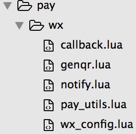

基于Openresty 的微信支付
=======================
##背景介绍
最近做公司网站的微信支付。很常见的一个功能，大概实现的东西就是在网站上选择相应的产品，使用微信扫一扫付款。很多网站都有这个功能，鉴于这个功能的如此常见决定记录下中间遇到的问题。

##相关软件
+ [Openresty 框架](https://moonbingbing.gitbooks.io/openresty-best-practices/content/index.html)：很长一段时间的了解后，一直在此基础上用Lua做Web 开发，目前用起来还比较顺手，随着她传播的更广，应该会有更多的组件和更丰富的管理工具。
+ [LuaXml 库](http://viremo.eludi.net/LuaXML/)：由于微信端收发数据都是xml 格式，所以在Lua端需要解析和生成xml的相关操作，选择这个Lua库后，准备用此做为解析生成工具库。
+ [微信扫码支付 --- 模式一](https://pay.weixin.qq.com/wiki/doc/api/native.php?chapter=6_4)：本次实践采用的是扫码支付中的***模式一***，相关介绍和支付流程可见微信官方的简介和流程图。
+ [微信支付接口签名校验工具](https://pay.weixin.qq.com/wiki/doc/api/jsapi.php?chapter=20_1)：由于初次接触微信支付，签名问题会相对麻烦，有此工具可对本身生成的sign和官方的sign进行比对，从而快速验证是否是sign出错。

##各种问题

####1. Resty 使用第三方LuaXml:

&emsp;&emsp;我目前使用的Openresty 版本是 `nginx version: openresty/1.11.2.1`，这个版本使用的Luajit是`luajit-5.1`，所以我使用的LuaXml版本是[LuaXML_101012.zip](http://viremo.eludi.net/LuaXML/LuaXML_101012.zip)，下载解压后得下面左图
	

	
&emsp;&emsp;修改其中***Makefile*** 文件,(修改第三个红线处时，注意***你的操作系统***) 红色划线为我本机上安装Openresty 的地址，将这些修改为你本机的地址即可。
	

	
&emsp;&emsp;修改后执行`make clean && make`，编译生成***LuaXML_lib.so***，将此目录下的 ***LuaXML_lib.so*** 和 ***LuaXml.lua*** 复制到Openresty安装目录下的***lualib***目录，如我的路径是：**/opt/openresty/lualib**

####2. 微信扫码支付时遇到的问题
以下几个问题是扫码支付最容易遇到的坑：

* 签名失败

	微信 [签名算法](https://pay.weixin.qq.com/wiki/doc/api/jsapi.php?chapter=4_3) 真的要把这里面 **每个字** 都看清楚。**（不要问我怎么知道的！QAQ）**
	
	任何签名有关的错误，检查方法就是上面提到的微信签名校验工具去调试，填入相关 ***参数*** 和  ***商户私钥key*** 帮你校验。
	
* 原生支付URL参数错误

	如果没有按照微信的要求生成二维码，就会出现这个错误;

* 获取商户订单信息超时或者商户返回的httpcode非200

	这个错误有两个原因：
	
	1. 扫码后，微信服务器回调不了你在商户后台设置的 ***callback*** 地址；
	
	2. 你的callback逻辑出错，没有正确返回200；

* 商户后台返回的数据字段结构不合法

	这个错误就是字面的意思，没有按照微信的要求返回相应的数据格式；
	

##不说了，看代码
####1. 代码目录结构:

> callback.lua: 用于接收客户扫码成功后，微信的回调;
> 
> genar.lua: 用于生成二维码字符串，前端接收到后根据此字串，使用第三方JavaScript库生成二维码;
>
> notify.lua: 用于接收微信服务端通知用户的支付情况;
> 
> pay_utils.lua: 一些相关xml函数;
> 
> wxconfig.lua:  配置appid、mch_id 等商户信息;